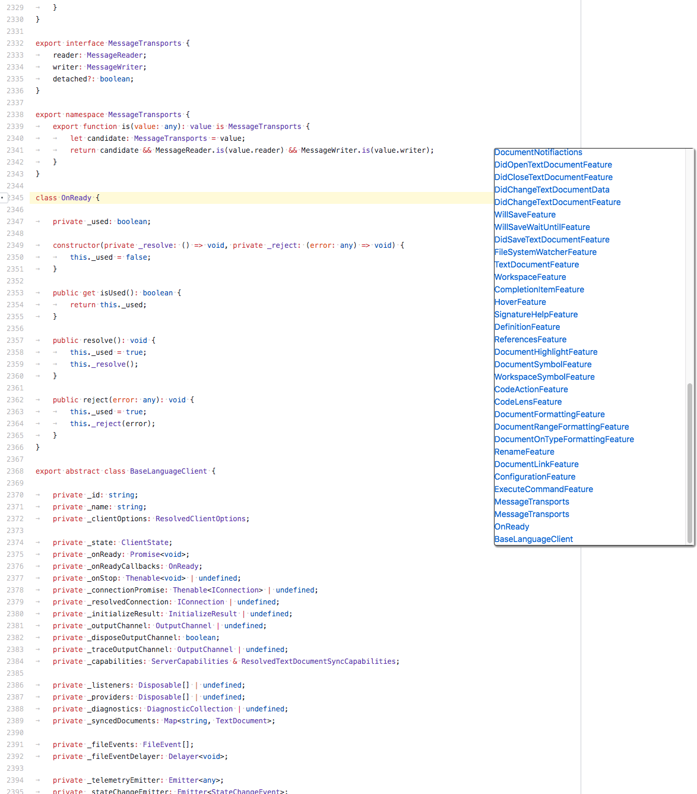
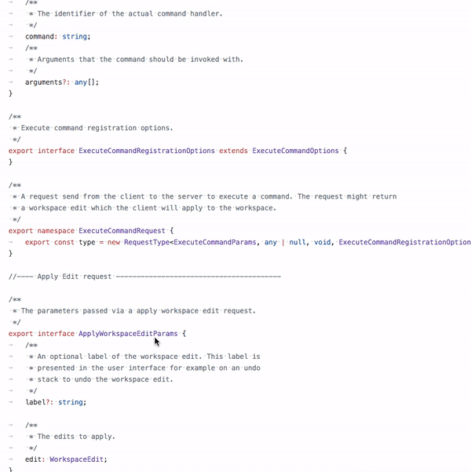

## LSIF TypeScript Chrome Extensions

### Features

- Navigate to document symbols

- Hover (show symbol type and description)

### TODO

- 优化 hover 的 tips 样式
- 支持 gotoDefinition
- 支持 findReferences
