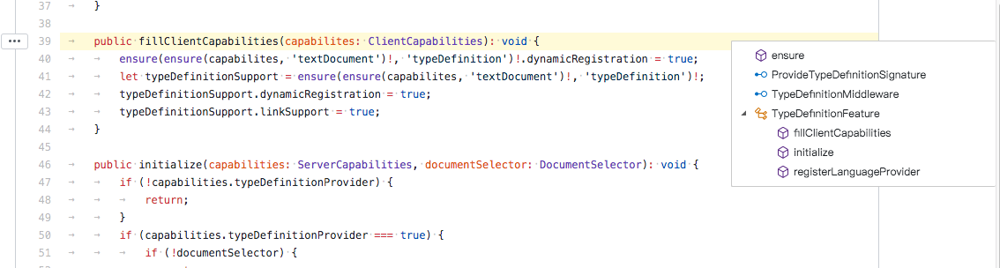
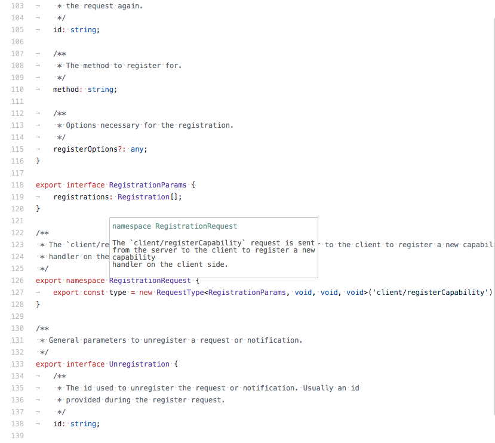

## LSIF TypeScript Chrome Extensions

### Features

- Navigate to document symbols

- Hover (show symbol type and description)

### TODO

- ~~优化 hover 样式~~
- 支持 gotoDefinition (有限的)
- 支持 findReferences
- ~~支持 CODING interprise (有限的)~~
- DOM 性能优化